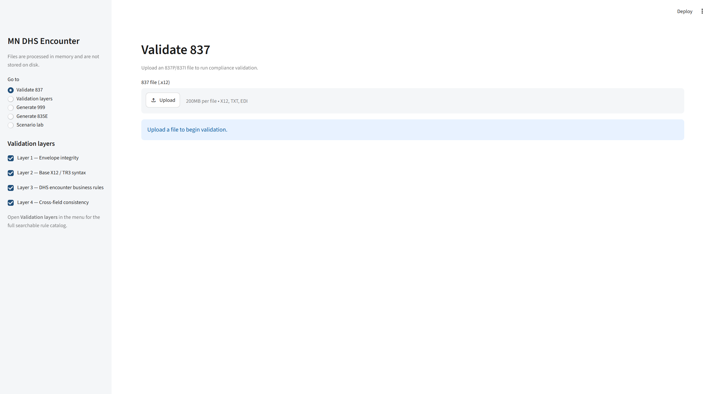
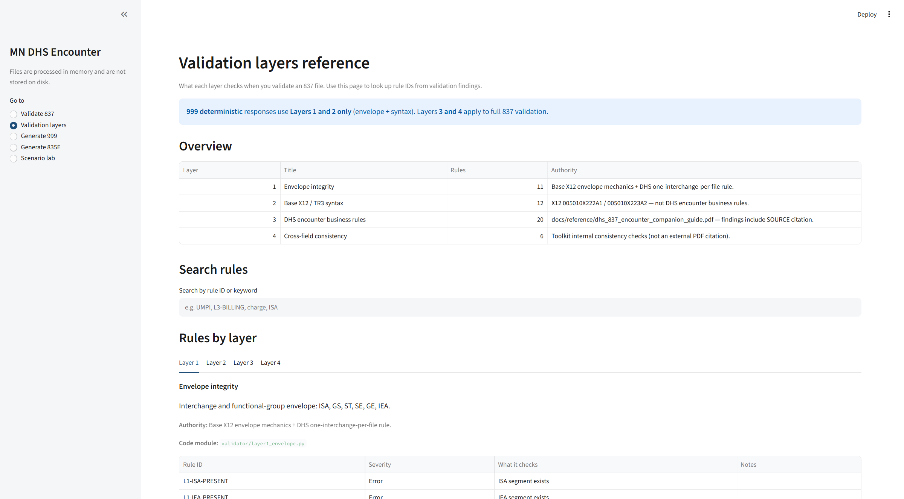
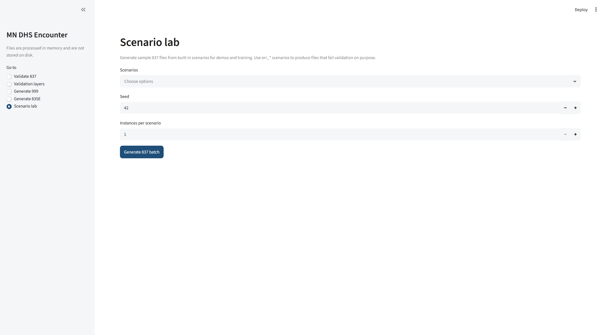
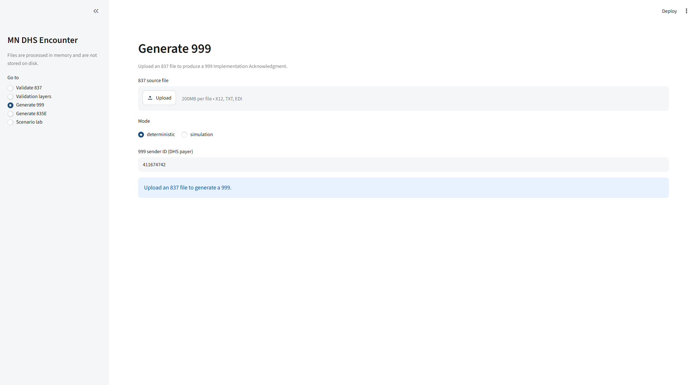

# MN DHS Encounter EDI Toolkit

**Cut encounter-file QA from days to seconds** — generate, validate, and preview DHS
837P/837I responses locally before MN–ITS submission.

[](https://www.python.org/downloads/)
[](tests/)
[](LICENSE)

| | |
|---|---|
| **Portfolio case study** | [`docs/CASE_STUDY.md`](docs/CASE_STUDY.md) |
| **Web UI (local)** | `pip install -e ".[ui]"` then `mn-encounter-ui` → http://localhost:8501 |
| **Try in 30 seconds** | [`examples/clean_batch.x12`](examples/clean_batch.x12) + [`examples/README.md`](examples/README.md) |

> **Independent project.** Not affiliated with Minnesota DHS. Synthetic data only —
> not for production submission.

---

## The problem

MCOs must report capitated member encounters to Minnesota DHS as **837P/837I**
files and wait for **999** acknowledgments and **835E** remittances. In practice,
QA and integration work is slowed by:

- **Long feedback loops** — MN–ITS test submissions run on batch schedules and
  processing windows, not on every save.
- **Hard iteration** — each fix means re-upload, re-wait, then parse X12 responses
  to find the next error.
- **Access friction** — trading-partner enrollment, test member IDs, and VPN
  requirements block developers and QA who only need rule-level confidence.
- **Weak reproducibility** — ad hoc test files are hard to recreate for regression
  or bug reports.

**Productivity impact:** a single rule violation can cost **hours or days** of
calendar time per MN–ITS cycle. Most of that wait is unnecessary for envelope,
syntax, and companion-guide checks that can run locally.

## What this toolkit does

| Capability | Speed / productivity benefit |
|------------|------------------------------|
| **Validate 837** (4 layers, 49 rules) | Sub-second feedback; JSON/CSV for CI |
| **Generate scenarios** (20+, seeded) | Realistic batches in ~1 s; repeatable `err_*` fixtures |
| **Preview 999 / 835E** | Skip waiting for DHS to see likely ack/remit shape |
| **Streamlit UI** | QA testers validate and look up rules without CLI |
| **Stdlib-only core** | `pip install -e .` — no runtime deps, runs offline |

```
Traditional:  edit → MN–ITS upload → wait → parse 999 → repeat     (hours–days)
This tool:    edit → validate → fix → gen999 preview → repeat     (seconds)
```

A Python 3.11+ toolkit for the Minnesota DHS **MCO encounter** workflow: synthetic
encounter data, X12 837P/837I validation, and 999/835E response generation — on a
custom, dependency-free X12 engine.

**No real PII is generated or used.** All provider/member identifiers are synthetic.

### Screenshots

| Validate 837 — claim-grouped findings | Validation layers — rule catalog |
|:---:|:---:|
|  |  |

| Scenario lab | Generate 999 |
|:---:|:---:|
|  |  |

### Quick start

```bash
python -m venv .venv && source .venv/Scripts/activate   # Windows: .venv\Scripts\Activate.ps1
pip install -e ".[dev,ui]"

# Zero-setup: validate committed examples
mn-encounter validate --in examples/clean_batch.x12
mn-encounter validate --in examples/err_missing_umpi.x12   # exits 1 — expected

# Full loop
mn-encounter generate --scenario clean_professional_original --seed 42 --out batch.x12
mn-encounter validate --in batch.x12 --format json
mn-encounter gen999 --in batch.x12 --out batch_999.x12
mn-encounter-ui   # browser UI at http://localhost:8501
```

---

## Why this exists (capabilities)

MCOs (Managed Care Organizations) submit "encounters" — records of
services rendered to MHCP members, even though DHS doesn't pay for them
directly (the MCO already did, under capitation) — to DHS as 837P/837I
files. This toolkit lets you:
1. Generate realistic, deterministic (seeded) synthetic encounter batches
   covering common and edge-case scenarios (TPL/COB, void/replacement,
   EPSDT, atypical providers, multiple MN public health programs, and a
   library of intentionally-invalid `err_*` fixtures).
2. Validate any 837P/837I file against four independent layers: envelope
   integrity, base X12 TR3 syntax, DHS-specific business rules (cited to
   the companion guide), and cross-field consistency.
3. Generate 999 and 835E response files, either deterministically (based
   on what the validator actually found / what the encounter actually
   reported) or in randomized simulation mode (for generating varied test
   fixtures).

## Project specification

[`docs/SPEC.md`](docs/SPEC.md) is the original requirements document this
toolkit was built against -- the canonical reference for "is the toolkit
doing what was asked." It's stored verbatim (not as a prompt transcript) so
it stays useful as a checklist independent of chat history.

## Architecture & design decisions

[`docs/ARCHITECTURE.md`](docs/ARCHITECTURE.md) captures *how* the toolkit
satisfies that spec: the architecture proposal reviewed and approved before
implementation began (custom X12 engine, four independent validation layers,
`Decimal`-only money, explicit RNG threading for determinism, etc.),
reconciled against what was actually built. Update it if the architecture
changes.

## Peer review tracker

[`docs/PEER_REVIEW_ACTION_PLAN.md`](docs/PEER_REVIEW_ACTION_PLAN.md) tracks
findings from external code review and their resolution status. Round 2 items
are in [`docs/PEER_REVIEW_ROUND2_ACTION_PLAN.md`](docs/PEER_REVIEW_ROUND2_ACTION_PLAN.md).

## Source documents

Every Layer 3 validation rule and every writer mapping comment cites the
exact page/loop/segment of a source document in `docs/reference/` (see
[`docs/reference/DOCUMENT_INDEX.md`](docs/reference/DOCUMENT_INDEX.md) for the
full audit trail, including which modules and rule IDs cite each PDF).
Where a document gap exists (e.g. no confirmed UMPI format, or no DHS-specific
835E structural spec), the relevant code carries a `# TODO: AMBIGUOUS IN SOURCE` /
`# TODO: VERIFY AGAINST [doc]` comment, and the gap is tracked in
[`KNOWN_LIMITATIONS.md`](KNOWN_LIMITATIONS.md).

## Installation

```bash
python -m venv .venv
source .venv/Scripts/activate   # Windows Git Bash / PowerShell
# source .venv/bin/activate     # Linux / macOS / WSL
pip install -e ".[dev]"
```

No runtime dependencies beyond the Python 3.11+ standard library for the **CLI
and validator**. `pytest` is the only dev dependency. The **web UI** is
optional — see [Web UI](#web-ui) below.

## Web UI

Functional testers can validate 837 files in a browser without using the CLI.
The UI calls the same validator library as `mn-encounter validate`; the CLI
is unchanged.

```bash
pip install -e ".[ui]"
mn-encounter-ui
# or: streamlit run ui/app.py
```

Opens `http://localhost:8501` with five pages:

| Page | Purpose |
|------|---------|
| **Validate 837** | Upload and validate with claim-grouped findings, filters, JSON/CSV export |
| **Validation layers** | Searchable catalog of all Layer 1–4 rules (for QA reference) |
| **Generate 999** | Upload 837 → download 999 (deterministic or simulation) |
| **Generate 835E** | Upload 837 → download 835E (deterministic or simulation) |
| **Scenario lab** | Build sample 837 files from registered scenarios (demos/training) |

Layer-by-layer rule reference: [`docs/VALIDATION_LAYERS.md`](docs/VALIDATION_LAYERS.md).

**Toolkit vs. DHS test:** when local validation is enough and when you still
need MN–ITS — [`docs/QA_VS_DHS_TEST.md`](docs/QA_VS_DHS_TEST.md).

**Note:** Files are processed in memory only and are not saved to disk by default.

## CLI usage

The package installs a `mn-encounter` entry point (or run it as
`python -m mn_encounter_toolkit.cli.main` if your `PATH` doesn't pick up
console scripts).

Typical workflow:

```
generate  →  validate  →  gen999 / gen835e
   837          check         responses
```

Both `gen999` and `gen835e` take the **original 837 file** as `--in`; they
do not read each other.

### Quick examples

```bash
# See every registered generator scenario
mn-encounter list-scenarios

# Generate a batch (repeatable --scenario, deterministic per --seed)
mn-encounter generate \
  --scenario clean_professional_original \
  --scenario clean_institutional_original \
  --scenario professional_with_tpl \
  --seed 42 \
  --out batch.x12

# Validate it (text or JSON, all four layers or a subset)
mn-encounter validate --in batch.x12
mn-encounter validate --in batch.x12 --format json --layers 1,2,4

# Generate response files from the same 837
mn-encounter gen999 --in batch.x12 --out batch_999.x12
mn-encounter gen835e --in batch.x12 --out batch_835e.x12

# Simulation mode: randomized (seeded) outcomes instead of the real findings
mn-encounter gen999 --in batch.x12 --out sim_999.x12 --mode simulation --seed 7
mn-encounter gen835e --in batch.x12 --out sim_835e.x12 --mode simulation --seed 7
```

### `list-scenarios`

Prints every scenario name you can pass to `generate`, with a one-line
description. Scenarios whose names start with `err_` are marked
`[ERROR FIXTURE]` -- they intentionally violate a rule for testing. Takes
no flags.

Exit code: `0`.

### `generate`

Builds one or more synthetic encounters and writes a single X12 837P/837I
interchange file.

A **scenario** defines the *shape* of the encounter (837P vs 837I, TPL,
void, EPSDT, error fixture, etc.). The **`--seed`** picks specific values
from synthetic reference pools (provider names, diagnosis codes, dollar
amounts, IDs) so each run looks realistic but is reproducible: same
scenario + same seed always produces the same file.

| Flag | Required | Default | Meaning |
|------|----------|---------|---------|
| `--scenario` | **Yes** (repeatable) | | Scenario name from `list-scenarios`. Repeat to mix multiple types in one file. |
| `--seed` | **Yes** | | RNG seed. Same seed + same scenarios → same output. |
| `--out` | **Yes** | | Output `.x12` file path. |
| `--count` | No | `1` | Number of instances of **each** `--scenario` to generate. |
| `--usage-indicator` | No | `T` | ISA15 usage: `T` = test, `P` = production. |
| `--isa-control-number` | No | `1` | ISA13 interchange control number. |
| `--gs-control-number` | No | `1` | GS06 functional-group control number. |
| `--st-control-number` | No | `1` | Starting ST02 transaction-set control number. |
| `--allow-inconsistent` | No | off | Write even when a non-`err_*` encounter fails an internal consistency check (normally refused). |

`err_*` scenarios are allowed to be inconsistent on purpose; you do not
need `--allow-inconsistent` for them.

Exit codes: `0` = file written; `2` = unknown scenario name or
consistency failure (with message on stderr).

### `validate`

Runs the validator against an X12 file (usually a generated 837). Validation
is fully deterministic -- no seed, no randomness.

| Flag | Required | Default | Meaning |
|------|----------|---------|---------|
| `--in` | **Yes** | | Input `.x12` file path. |
| `--format` | No | `text` | Report format: `text` (human-readable) or `json` (structured). |
| `--layers` | No | `1,2,3,4` | Comma-separated subset of layers to run (see table below). |
| `--out` | No | stdout | Write the report to this file instead of printing it. |

**Validation layers:** see [`docs/VALIDATION_LAYERS.md`](docs/VALIDATION_LAYERS.md) for the full rule-by-rule reference.

| Layer | What it checks |
|-------|----------------|
| **1** | Envelope integrity (ISA/GS/ST/SE/GE/IEA control numbers, segment counts) — 11 rules |
| **2** | Base X12 TR3 syntax (money/date formats, NPI check digit, required segments) — 12 rules |
| **3** | DHS encounter business rules (UMPI, MCO-paid amount, payer/receiver, etc.; cited to the companion guide) — 20 rules |
| **4** | Cross-field consistency (charge balance, diagnosis pointers, void/replacement ICN) — 6 rules |

Exit codes (CI-friendly):

| Code | Meaning |
|------|---------|
| `0` | No **error**-level findings (warnings alone still exit `0`) |
| `1` | At least one error-level finding |
| `2` | File unreadable, validator crash, or invalid CLI arguments |

### `gen999`

Generates a **999 Implementation Acknowledgment** from an original 837
file -- DHS's "we received your submission" response.

| Flag | Required | Default | Meaning |
|------|----------|---------|---------|
| `--in` | **Yes** | | Original 837 file path. |
| `--out` | **Yes** | | Output 999 `.x12` file path. |
| `--mode` | No | `deterministic` | `deterministic` = acknowledge what Layers 1–2 actually find; `simulation` = random accept/reject outcomes. |
| `--seed` | No | `0` | RNG seed; **simulation mode only**. |
| `--sender-id` | No | `411674742` | DHS payer ID written to ISA06/GS02 (sender of the 999). |
| `--isa-control-number` | No | `1` | ISA13 control number on the 999. |
| `--outcome-weights` | No | | Simulation only, e.g. `"A=70,E=20,R=10"` (`A` = accept, `E` = accept with errors, `R` = reject). |

In **deterministic** mode the generator re-runs this project's own Layer 1
and Layer 2 checks against the input 837 and reflects the real result in
`AK3`/`AK5`/`AK9` segments. In **simulation** mode it ignores actual
validity and draws a seeded random outcome instead.

Exit codes: `0` = file written; `2` = input unreadable or generation failed.

### `gen835e`

Generates an **835E encounter remittance** from an original 837 file --
DHS echoing back what the MCO reported as paid.

| Flag | Required | Default | Meaning |
|------|----------|---------|---------|
| `--in` | **Yes** | | Original 837 file path. |
| `--out` | **Yes** | | Output 835E `.x12` file path. |
| `--mode` | No | `deterministic` | `deterministic` = echo MCO-paid amounts already in the 837; `simulation` = random paid/partial/denied outcomes. |
| `--seed` | No | `0` | RNG seed; **simulation mode only**. |
| `--payment-method` | No | `NON` | BPR payment method: `NON` (notification only), `ACH`, `CHK`, or `FWT`. |
| `--isa-control-number` | No | `1` | ISA13 control number on the 835E. |
| `--outcome-weights` | No | | Simulation only, e.g. `"paid_full=55,paid_partial=30,denied=15"`. |

In **deterministic** mode the generator reads the MCO's own adjudication
already present in the 837 (`AMT*D` / `AMT*EAF` in Loop 2320, `REF*9D` /
`REF*9C` at the line level) and formats it as `CLP` / `SVC` / `CAS` in the
835E. In **simulation** mode it ignores those amounts and assigns random
outcomes per claim instead.

Exit codes: `0` = file written; `2` = input unreadable or generation failed.

### Command summary

| Command | Input | Output | Purpose |
|---------|-------|--------|---------|
| `list-scenarios` | — | scenario list (stdout) | Discover valid `--scenario` names |
| `generate` | scenario names + seed | `.x12` 837 | Synthetic encounter submission |
| `validate` | `.x12` 837 | report (stdout or `--out`) | Check file against rule layers |
| `gen999` | `.x12` 837 | `.x12` 999 | Acknowledgment response |
| `gen835e` | `.x12` 837 | `.x12` 835E | Remittance response |

## Project structure

```
src/mn_encounter_toolkit/
  models/        Core dataclasses: MCO, Provider, Member, Encounter, ServiceLine, ...
  refdata/       MN geography / ICD-10-CM / CPT-HCPCS-revenue-code reference pools
  identifiers/   NPI (Luhn check), UMPI, TIN generation
  generator/     Scenario registry + named scenarios + pre-write consistency checks
  edi/           X12 primitives, writer (Encounter -> 837P/837I text), parser (text -> loop tree)
  validator/     Four independent rule layers + findings model + orchestration
  response/      999 and 835E generators (deterministic + simulation modes), CARC/RARC pool
  cli/           argparse subcommands wiring the above together
tests/
  unit/          One test module per source module, each rule individually testable
  integration/   Full generate -> validate -> gen999/gen835e pipeline, and CLI-level tests
docs/reference/  Acquired source documents + DOCUMENT_INDEX.md
KNOWN_LIMITATIONS.md   Every source-document gap and stubbed/ambiguous rule, with file locations
```

## Running tests

```bash
pytest
```

Tests build fixtures by calling the generator's own functions directly
(never by shelling out to the CLI for fixture creation); CLI behavior
itself is covered separately in `tests/integration/test_cli.py`.

## Determinism

Every entry point that involves randomness takes an explicit `--seed` (CLI)
or `random.Random` instance (library), and no module reads from the global
`random` module. The same seed always reproduces byte-identical output.

## Known limitations

See [`KNOWN_LIMITATIONS.md`](KNOWN_LIMITATIONS.md) for the full list of
source-document gaps and how this toolkit resolved (or stubbed) each one --
most notably: an unconfirmed UMPI format, a CLM05-3=7 (replacement) value
not enumerated in the retrieved DHS guide's own tables, and the 835E
generator's structure being an adaptation (not a confirmed DHS spec) since
no DHS-specific 835E companion guide was retrievable.
