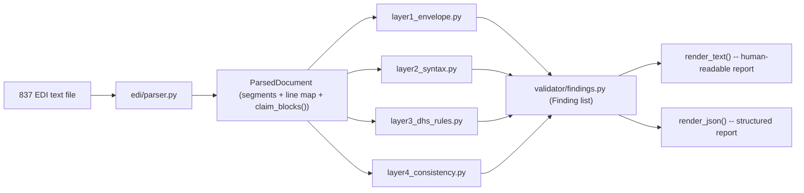

# MN DHS Encounter EDI Toolkit -- Architecture & Design Decisions

> **Provenance**: this document captures the architecture proposal that was
> reviewed and approved *before* any significant implementation began
> (2026-06-30), reconciled against what was actually built. See
> [`docs/SPEC.md`](SPEC.md) for the *requirements* this design satisfies, and
> [`KNOWN_LIMITATIONS.md`](../KNOWN_LIMITATIONS.md) for every place a source
> document was ambiguous or incomplete and how that was resolved.
>
> The original proposal (as presented for approval) is preserved verbatim at
> `~/.cursor/plans/mn_dhs_encounter_edi_toolkit_c9f572c0.plan.md`; this file
> is the version of record going forward and should be updated if the
> architecture changes, since the plan file itself is not meant to be edited.

## Confirmed architecture decisions

1. **Custom X12 engine, no third-party EDI library.** A purpose-built
   tokenizer/loop-tree builder (`edi/x12_core.py`, `edi/writer.py`,
   `edi/parser.py`) gives full control over configurable separators,
   per-segment line-number tracking (needed so validator findings can point
   at an exact line), and the field-mapping / source-citation comments the
   spec requires on every mapped element. This avoids depending on
   old/lightly-maintained third-party libraries (e.g. `pyx12`) for a
   dependency-free, portable toolkit.
2. **Validator exit-code convention** (CI-friendly): `0` = no error-level
   findings (warnings/info never fail a pipeline), `1` = at least one
   error-level finding, `2` = the validator crashed or the file couldn't even
   be parsed (or the CLI's own arguments were invalid). Implemented in
   `validator/findings.py` (`exit_code_for`) and enforced at the `cli/main.py`
   boundary, which never lets a parser exception escape uncaught.
3. **Python stdlib-first, zero runtime dependencies.** Only `dataclasses`,
   `decimal`, `datetime`, `enum`, `argparse`, `random`, `json`, and `re` from
   the standard library. `pytest` is the only dev dependency. This maximizes
   portability -- `pip install -e .` with nothing else required, no DB, no
   network access at runtime.
4. **Money is always `Decimal`, never `float`.** Every amount field in
   `models/`, every arithmetic comparison in Layer 4 (`L4-CHARGE-BALANCE`,
   `L4-TPL-AMOUNTS-BALANCE`), and every computed write-off/adjustment in the
   835E generator uses `Decimal`, to avoid floating-point rounding artifacts
   in financial comparisons.
5. **Determinism via explicitly-threaded `random.Random` instances.** No
   module reads from the global `random` module; every generator and
   response-generator function takes an `rng: random.Random` parameter (or a
   `--seed` at the CLI boundary that constructs one). The same seed always
   reproduces byte-identical output (verified end-to-end, including
   `gen999`/`gen835e` simulation mode). Scenario registration
   (`generator/scenarios/registry.py`) is a simple decorator-based dict
   registry, so adding a scenario never requires touching core code.

## Project structure (as built)

```
mn-dhs-encounter-toolkit/
  docs/
    SPEC.md                      # verbatim original requirements
    ARCHITECTURE.md              # this file
    reference/                   # acquired source documents + DOCUMENT_INDEX.md
  KNOWN_LIMITATIONS.md
  README.md
  pyproject.toml
  src/mn_encounter_toolkit/
    models/
      core.py                    # MCO, Provider, Member, MNAddress, TPLPayer + DHS constants
      encounter.py                # Encounter, ServiceLine, Diagnosis, FrequencyCode, ...
    refdata/
      mn_geo.py                   # real MN city/ZIP pools (Twin Cities, Duluth, Rochester, outstate)
      diagnoses.py                 # ICD-10-CM pool weighted to MN MCO populations
      procedures.py                # CPT/HCPCS/H-codes/revenue codes/ICD-10-PCS pools
      payers.py                    # synthetic MCO trading-partner-id / payer-id pools
    identifiers/
      npi.py                        # NPI generation + Luhn (ISO 7064 mod 10, "80840" prefix) validation
      umpi.py, tin.py
    generator/
      entities.py                    # MCO/Provider/Member generation, seeded
      scenarios/
        registry.py                   # @register_scenario decorator + lookup
        clean.py, tpl.py, void_replacement.py, epsdt.py, programs.py,
        misc.py, atypical.py, errors.py, common.py
      consistency.py                   # pre-write internal-consistency checks
    edi/
      x12_core.py                       # Segment/Element model, separator detection, control numbers
      writer.py                         # Encounter -> 837P/837I segments, field-mapped comments
      parser.py                         # X12 text -> structured loop tree with source line numbers
    validator/
      findings.py                        # Finding dataclass, text/JSON rendering, exit_code_for
      rule_registry.py                    # shared RuleRegistry infra for Layers 2-4
      layer1_envelope.py
      layer2_syntax.py                     # registered, individually-testable syntax rules
      layer3_dhs_rules.py                  # every rule cited to a document/section
      layer4_consistency.py
      run.py                                # orchestrates all four layers independently, merges findings
    response/
      gen_999.py                            # deterministic (re-validates) + simulation modes
      gen_835e.py                           # deterministic (echoes MCO adjudication) + simulation modes
      carc_rarc.py                          # CARC/RARC pairs, sourced from mucg_835.pdf Appendix A
    cli/
      main.py                                # argparse subcommands: generate, validate, gen999, gen835e, list-scenarios
    web/
      enrich.py                              # Finding -> claim-level context for UI display
      validate_service.py                    # upload validation + JSON/CSV export
      response_service.py                    # 999/835E generation from uploaded 837 text
      generate_service.py                    # scenario-lab batch generation
      views.py                               # Streamlit page renderers
      entry.py                               # mn-encounter-ui launcher
  ui/
    app.py                                   # Streamlit shell (sidebar navigation)
  tests/
    unit/                                      # one test module per source module above
    integration/                                # full generate -> validate -> gen999/gen835e pipeline, CLI-level tests
```

*Deviation from the original sketch*: the plan proposed a standalone
`response/response_scenarios.py`; in practice the deterministic/simulation
split lives directly inside `gen_999.py` and `gen_835e.py` as two functions
each (`build_deterministic_remits`/`build_simulated_remits`, etc.) rather than
a separate scenarios module -- there was no need for a registry here since
there are only two response transaction types, not an open-ended list like
the 837 generator scenarios.

## Data model shape

`models/core.py` holds the "who" (MCO, Provider, Member, MNAddress,
TPLPayer); `models/encounter.py` holds the "what" (Encounter, ServiceLine,
Diagnosis, and the DHS-specific `FrequencyCode` / institutional detail
types). All are `@dataclass(frozen=True)`; scenario variants are produced by
`dataclasses.replace(base, ...)` rather than mutation, so a scenario function
like `void_encounter` or `replacement_encounter` can start from a clean base
encounter and override just the fields that make it a void/replacement/error
case, while the base stays reusable and immutable.

Each `Encounter` is built entirely by scenario functions registered in
`generator/scenarios/`. Before anything is written to X12,
`generator/consistency.py` runs and raises a descriptive
`InconsistentEncounterError` for problems like a charge-sum mismatch or a
missing ICN on a void -- this is the "refuse to write an internally
inconsistent encounter" requirement. The `err_*` scenarios intentionally
bypass specific consistency checks (via an explicit `allow_inconsistent`
escape hatch in the CLI) to produce a bad file *on purpose*, clearly marked
in the scenario function itself.

## Validation layer flow



Each layer takes the same `ParsedDocument` and returns `list[Finding]`
independently -- **no layer calls another**, and `validator/run.py` simply
concatenates their outputs. This means any single layer, or any single rule
within Layer 2/3/4, can be unit-tested in isolation with a hand-built
`ParsedDocument` and no dependency on the rest of the pipeline (see
`tests/unit/test_layer*.py`).

Layers 2, 3, and 4 share one piece of infrastructure --
`validator/rule_registry.py`'s `RuleRegistry` -- a small decorator-based
registry (`@LAYERN.register(rule_id, description, source_citation=...)`) that
is what actually satisfies "every validation rule must be individually
testable": each registered function can be called directly, and
`RuleRegistry.run()` just loops over all registered rules for that layer.
Layer 1 (envelope) doesn't need this since its checks are inherently a fixed,
small set tied to ISA/GS/ST structure rather than an open-ended rule list.

## Source-citation discipline (Layer 3)

Every Layer 3 rule function, and every field-mapping comment in
`edi/writer.py`/`models/encounter.py`, carries a `SOURCE:` comment citing the
exact document and page/section, e.g.:

```python
# SOURCE: dhs_837_encounter_companion_guide.pdf -- p.16 (837P) / p.40 (837I)
# DHS requires UMPI as the secondary identifier (qualifier G2) for atypical
# providers (no NPI under MN statute); TIN is primary in this case.
```

Findings surfaced by Layer 3 rules also carry `source_citation` as a
structured `Finding` field (rendered as a `SOURCE:` line in text output and a
`source_citation` key in JSON), so the citation isn't just a code comment --
it's visible in the validator's actual output. Rules that cannot be confirmed
from the retrieved documents get a `# TODO: VERIFY AGAINST [document]` /
`# TODO: AMBIGUOUS IN SOURCE` comment and a corresponding entry in
[`KNOWN_LIMITATIONS.md`](../KNOWN_LIMITATIONS.md).

## Response generation design (999 / 835E)

Both response generators share one shape: a `generate_*_deterministic(text)`
function and a `generate_*_simulated(text, rng, ...)` function.

- **999 deterministic mode** doesn't template a canned acceptance -- it
  actually re-runs this project's own Layer 1 + Layer 2 validation (the two
  layers within a 999's scope; Layers 3-4 are DHS/cross-field business rules
  a 999 doesn't speak to) against the input file and reports exactly what was
  found via `AK3`/`AK4`/`AK5`/`AK9`.
- **835E deterministic mode** parses the original 837's claim blocks and
  echoes back the MCO's own already-reported adjudication (`AMT*D`/`AMT*EAF`
  in Loop 2320, `REF*9D`/`REF*9C` at the line level) rather than computing a
  new adjudication -- because DHS's encounter "remittance" is fundamentally
  an acknowledgment of what the MCO already paid under capitation, not a new
  payment decision.
- **Simulation mode** (both) ignores the input file's actual content/validity
  and draws a randomized, seeded outcome instead, for generating varied test
  fixtures on demand.

This mirrors the "traceability" requirement in the other direction: instead
of citing a source document, these generators cite *this project's own
validator* or *the original submitted 837* as their input, which is called
out explicitly in each module's docstring.

## Web UI (optional `[ui]` extra)

A Streamlit front end (`ui/app.py`, launched via `mn-encounter-ui`) wraps the
same library functions as the CLI — it does not duplicate validator or response
logic. Pages: **Validate 837**, **Generate 999**, **Generate 835E**, and
**Scenario lab**. Uploads are processed in memory; the core package remains
installable without Streamlit (`pip install -e .`).

## Build order (matches the spec's "working process")

1. Data models + reference data pools (`models/`, `refdata/`, `identifiers/`)
2. Scenario registry + named generation scenarios + consistency checks (`generator/`)
3. X12 writer: encounter records -> 837P/837I files (`edi/writer.py`)
4. X12 parser: EDI text -> loop tree (`edi/parser.py`)
5. Validator Layers 1, 2, 4 (no companion-guide dependency)
6. Validator Layer 3 (DHS rules, citing the retrieved guide)
7. 999 generator
8. 835E generator
9. CLI wiring + integration tests

Tests were written alongside each step using the generator's own functions
directly as fixtures (never by shelling out to the CLI for fixture creation);
CLI behavior itself is covered separately in `tests/integration/test_cli.py`.

## Known trade-offs and open flags

- The DHS 837 Encounter Companion Guide's own CLM05-3 value tables only
  enumerate "1" (original) and "8" (void) -- "7" (replacement) is used per
  the spec's explicit instruction, which is a genuine conflict between the
  spec and the guide's literal example tables. Resolved by keeping CLM05-3=7
  *and* emitting the guide's documented correction-tracking NTE segment. See
  `models/encounter.py` and `KNOWN_LIMITATIONS.md`.
- No DHS-specific 835E structural specification was retrievable (the AUC
  835 MUCG is explicitly *not* authoritative for encounter responses per
  DHS's own landing page). The 835E generator is therefore an adaptation of
  the base 835 mechanics, not a confirmed DHS spec -- see the prominent
  caveat at the top of `response/gen_835e.py` and `KNOWN_LIMITATIONS.md`.
- The MN-ITS AUC guide index page and the DHS encounter landing page's
  linked accordion resources (JS-rendered, not retrievable via plain HTTP)
  were not fully enumerable; logged as a follow-up in
  `KNOWN_LIMITATIONS.md` rather than blocking implementation.
