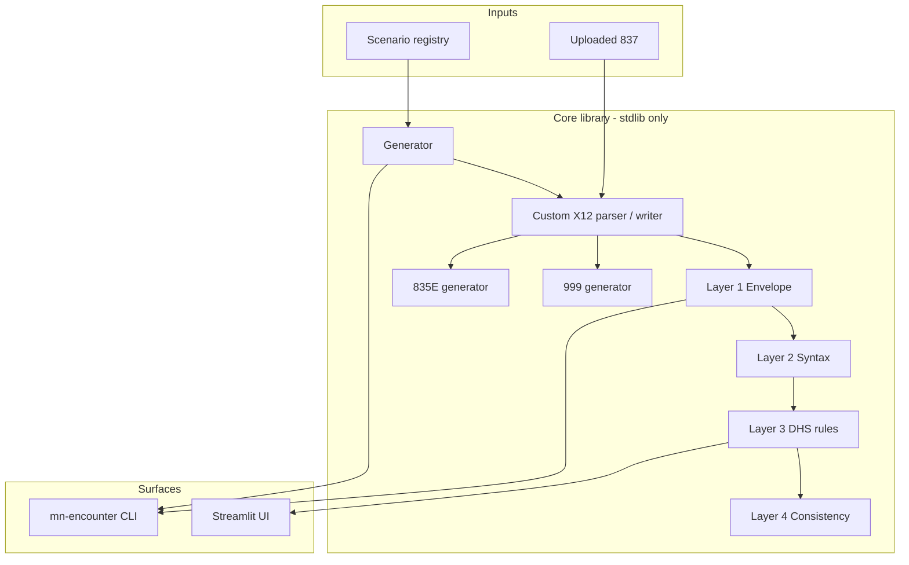

# Case study: MN DHS Encounter EDI Toolkit

> **Disclaimer:** Independent developer project. Not affiliated with or endorsed by
> Minnesota DHS. Uses synthetic data only — not for production submission to MN–ITS.

## Problem: slow feedback loops block encounter QA

Managed Care Organizations (MCOs) must report capitated care to Minnesota DHS as
**837P/837I encounter files**. Before a batch is accepted, teams need to answer:

- Does the file pass envelope and syntax checks (what drives a **999**)?
- Does it satisfy DHS encounter business rules (UMPI, MCO-paid amounts, payer identity)?
- Will downstream systems handle the **835E** remittance shape?

### The productivity gap

| Traditional path (MN–ITS test) | This toolkit |
|-------------------------------|--------------|
| Edit file → upload → wait for DHS processing window | Validate locally in **under a second** |
| Biweekly encounter cycles; cutoffs and batch queues | Iterate **immediately**, any time of day |
| Requires trading-partner access, VPN, coordinated test IDs | Runs **offline** on a laptop or in **CI** |
| Hard to reproduce the same bad file twice | **Seeded** synthetic scenarios → byte-identical fixtures |
| 999/835E arrive later; root cause buried in X12 | **Deterministic** response preview from the same 837 |
| QA depends on EDI specialists and CLI tools | **Streamlit UI** for upload, rule lookup, export |

**Net effect:** validation and fixture work that might take **hours or days** per
MN–ITS round-trip can run in **seconds**, hundreds of times per day, without
touching production or test enrollment data.

MN–ITS remains the **authoritative** integration test — see
[`QA_VS_DHS_TEST.md`](QA_VS_DHS_TEST.md). This tool compresses everything *before*
that submission.

---

## Solution

A Python toolkit that covers the MCO encounter **dev/QA loop** end to end:

1. **Generate** synthetic 837P/837I batches (20+ scenarios, including intentional `err_*` fixtures)
2. **Validate** against four independent layers (49 rules), with DHS companion-guide citations on Layer 3
3. **Preview** 999 and 835E responses (deterministic or simulation)
4. **Explore** rules in a browser UI (validate, layer catalog, scenario lab)

```
Scenario lab / CLI generate  →  Validate (L1–L4)  →  gen999 / gen835e
         ~1 s                         ~0.5 s              ~1 s
```

---

## Architecture (high level)



**Key design choices:**

| Decision | Rationale |
|----------|-----------|
| Custom X12 engine (no pyx12, etc.) | Line-accurate findings, configurable separators, full control for citations |
| Four validation layers | Envelope vs TR3 syntax vs DHS business rules vs cross-field invariants — run subsets in CI |
| `Decimal` for all money | Avoid float rounding in charge-balance and remittance logic |
| Threaded `random.Random` / `--seed` | Reproducible synthetic data and simulation fixtures for regression |
| Streamlit wraps library | Same code paths as CLI; UI is optional extra |

Details: [`ARCHITECTURE.md`](ARCHITECTURE.md)

---

## What I built

| Area | Deliverable |
|------|-------------|
| **EDI engine** | Parser, writer, segment tokenizer with MN DHS envelope profile |
| **Validator** | 11 + 12 + 20 + 6 rules across Layers 1–4; JSON/text reports; CI exit codes |
| **Generator** | Scenario registry, MN refdata pools, pre-write consistency checks |
| **Responses** | 999 (re-validates L1–L2), 835E (echoes MCO-reported adjudication) |
| **CLI** | `generate`, `validate`, `gen999`, `gen835e`, `list-scenarios` |
| **Web UI** | Validate, validation layers reference, 999/835E, scenario lab |
| **Quality** | 158 automated tests; two peer-review passes documented |
| **Docs** | Spec, architecture, rule catalog, QA vs DHS scope, known limitations |

---

## Proof points (for reviewers)

- **158 tests** — unit per module + integration pipeline + CLI
- **49 validation rules** — searchable in UI and [`VALIDATION_LAYERS.md`](VALIDATION_LAYERS.md)
- **Source traceability** — Layer 3 findings cite `dhs_837_encounter_companion_guide.pdf` page/loop
- **Honest scope** — [`KNOWN_LIMITATIONS.md`](../KNOWN_LIMITATIONS.md) documents document gaps (UMPI format, 835E spec)
- **Examples** — [`examples/`](../examples/) includes clean and error fixtures with JSON reports

### Sample negative test

Upload `examples/err_missing_umpi.x12` → finding `L3-BILLING-UMPI-REQUIRED` with companion-guide citation.

---

## Outcomes (productivity & engineering)

- **Faster QA cycles:** instant validation vs waiting on MN–ITS batch processing
- **Cheaper iteration:** no test enrollment or PII required for most rule coverage
- **CI-ready:** exit codes `0` / `1` / `2`; JSON export for automation
- **Onboarding:** QA can use the UI and rule catalog without reading raw X12
- **Regression:** same seed reproduces the same encounter batch and simulation responses

---

## What I would do next

1. **GitHub Actions** — pytest on every push; coverage badge
2. **AK302 fidelity** — segment position in deterministic 999s
3. **DHS accordion PDFs** — encounter-specific 999 naming and 835E remark codes (browser retrieval)
4. **Optional FastAPI** — read-only validate endpoint for pipeline integration

---

## Resume bullet

Built a Python toolkit to accelerate Minnesota Medicaid MCO encounter EDI testing:
four-layer 837P/837I validation with DHS-traceable rules, seeded synthetic scenario
generation, 999/835E response preview, and a Streamlit QA UI — enabling sub-second
local feedback loops and CI regression without MN–ITS round-trips (158 tests;
stdlib-only core).
